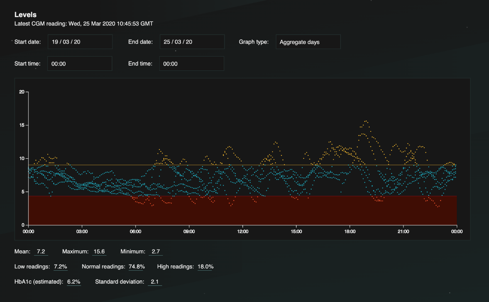

Levels
------

*Note: This is a work in progress*

Levels is an application I've been writing for users of continuous glucose monitors. This lets you analyse all the data ever collected from a CGM device.

---
#### Tech stack

Technically it is quite new. The frontend is written with `NextJS` 9 (React), `Typescript` 3.7, `Redux`, and with a few tests written with `Jest` and `Testing-Librar`y. The graphs are still in their early stages, but I have written a composite graph which overlays so you can see an "area" over time per week, and linear which is data over time. These are written with the `D3` library. It also uses `react-select`, `react-datepicker` and `date-fns`.

Data is retrieved from a `mongodb` database using date and time parameters. The code for this is written with `lambda functions`, `mongoose` and `typescript`.

Creation of the database and updates are done via the Dexcom G6 unit. This is able to transmit glucose testReadings to a phone via bluetooth every 5 minutes. These  have the testReadings in mg/dl, the timestamp and some noise data. Once the phone receives these, the Dexcom application is configured to then upload them to a mongo database I have setup - for now I am just using MLab to store the data.

---
#### How to run

The easiest way is not to run it, as you wont have my database keys. I've put it online at https://levels-frontend.netlify.com. Data is live and currently transmitting from my arm.

Folder structure is `frontend` (frontend) / `lambda` (backend), so very simple.

##### Frontend

Do a `yarn install` or `npm install`.
Either use `yarn` or `npm start`. I'd suggest yarn if you have it installed.
Easiest way is to `yarn dev` / `npm run dev` at the moment.
Tests are `yarn test` / `npm test`.

##### Backend

Do a `yarn install` or `npm install`.
Run with `yarn start` / `npm start`
